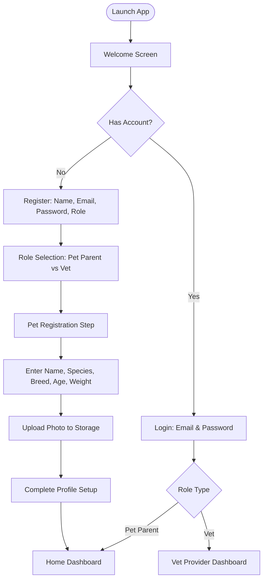
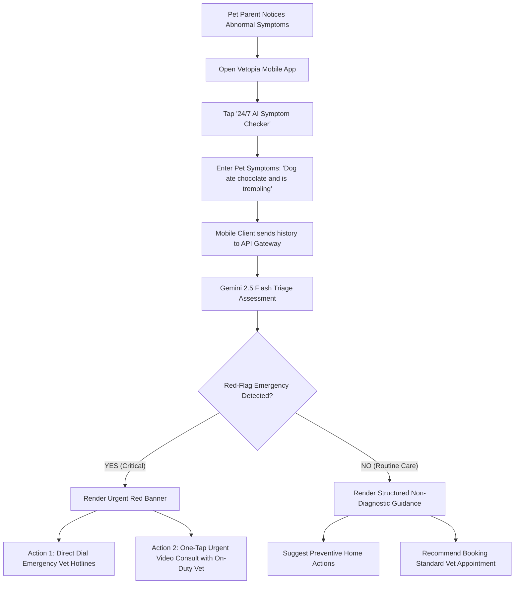
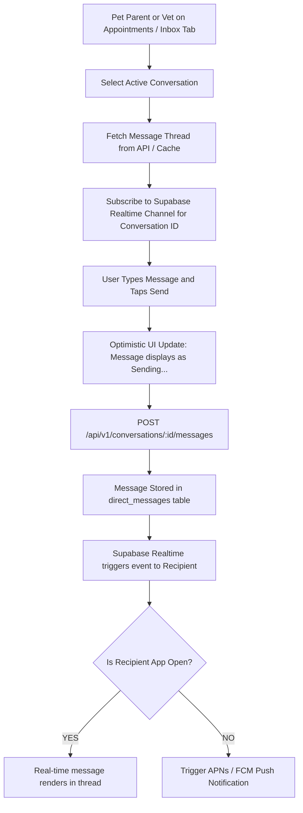

# User Flows & Journeys — Vetopia Mobile MVP

## 1. Master Telemedicine Consultation Lifecycle

This flow represents the primary business loop of Vetopia Mobile, connecting discovery, scheduling, consultation, and clinical prescription delivery.

```mermaid
sequenceDiagram
    autonumber
    actor Parent as Pet Parent
    actor Vet as Veterinarian
    participant App as Mobile App (Expo)
    participant API as Express API / Supabase
    participant WebRTC as WebRTC Media Stream

    Note over Parent, Vet: Phase 1: Discovery & Scheduling
    Parent->>App: Browse Doctors (Filter by Specialty & Language)
    App->>API: GET /api/v1/vets
    API-->>App: Return Doctor Directory
    Parent->>App: Select Doctor & View Live Available Slots
    App->>API: GET /api/v1/vets/:id/schedule
    API-->>App: Calculated Slots Array
    Parent->>App: Select Pet, Symptoms & Time Slot
    Parent->>App: Confirm Booking (Mock/Apple Pay)
    App->>API: POST /api/v1/appointments
    API-->>App: Appointment Created (Status: scheduled)
    API-->>Vet: Push Notification (New Appointment Booked)

    Note over Parent, Vet: Phase 2: Waiting Room & Consultation
    API-->>Parent: Push Notification (Consultation in 15 mins)
    API-->>Vet: Push Notification (Consultation in 15 mins)
    Parent->>App: Tap "Join Consultation Room"
    Vet->>App: Tap "Open Patient Room"
    App->>App: Check Mic & Camera Permissions
    App->>API: Connect to Realtime call_signals Channel
    Vet->>App: Tap "Start Call" (Send SDP Offer)
    App->>API: INSERT call_signals (kind: 'offer')
    API-->>Parent: Receive SDP Offer
    Parent->>App: Accept Call (Send SDP Answer)
    App->>API: INSERT call_signals (kind: 'answer')
    App<->WebRTC: Establish P2P Audio/Video Connection
    Note over Parent, Vet: Live Consultation Active (Video + Audio + In-call Chat)

    Note over Parent, Vet: Phase 3: Completion & Prescription
    Vet->>App: Tap "End Consultation"
    App->>API: PUT /api/v1/appointments/:id/complete
    App->>WebRTC: Disconnect & Stop All Media Tracks
    Vet->>App: Open "Issue Prescription" Form
    Vet->>App: Add Medications, Dosage, Duration & Instructions
    App->>API: POST /api/v1/prescriptions
    API-->>Parent: Push Notification (Prescription Ready)
    Parent->>App: View & Download PDF Prescription
```

---

## 2. Onboarding & Pet Registration Flow



---

## 3. 24/7 AI Triage & Emergency Escalation Flow



---

## 4. 1-to-1 Clinical Messaging Journey



---

## 5. Summary of User Journeys

1. **User Registration & Login:** Email/password creation, biometric Face ID enrollment, profile setup.
2. **Pet Passport Management:** Add/edit pet records, view offline vaccination history.
3. **Veterinarian Discovery:** Search directory, filter by language/specialty, review doctor credentials.
4. **Appointment Booking:** Select pet, pick time slot, provide symptoms, confirm reservation.
5. **Live Telemedicine:** Join waiting room, grant camera/mic permissions, engage in WebRTC video call.
6. **Prescription Fulfillment:** Doctor writes e-prescription; pet parent views instructions and exports PDF.
7. **Clinical Messaging:** Post-consultation follow-up text messaging with attached appointment metadata.
8. **AI Symptom Triage:** Natural language symptom input, emergency detection, automated clinical escalation.
