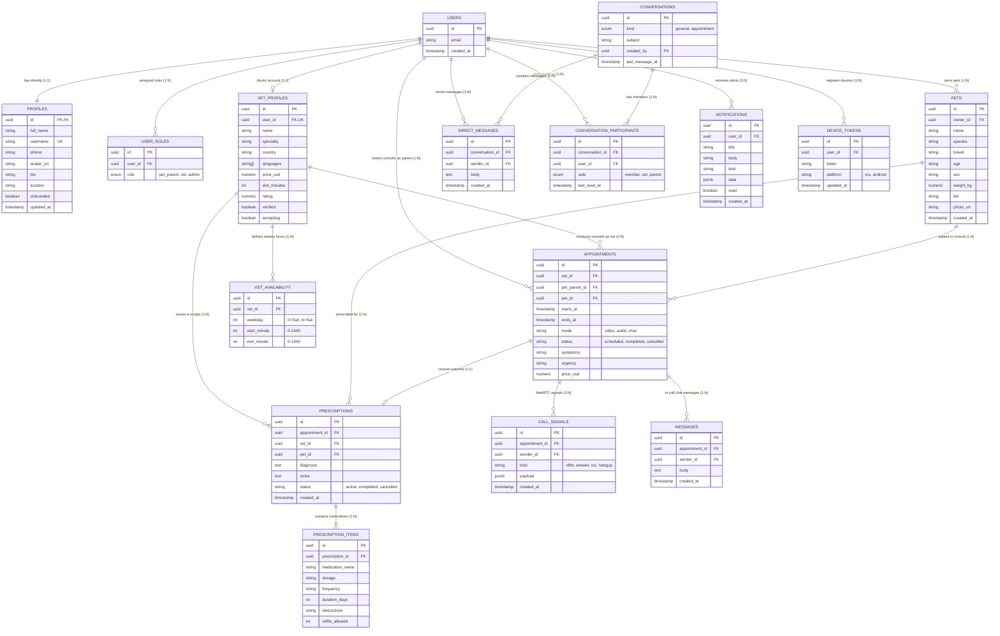

# Entity Relationship Diagram (ERD) — Vetopia Mobile MVP

This diagram illustrates the relational database model for the **Vetopia Mobile MVP**, showing primary keys, foreign keys, cardinality, and relationships across users, pets, clinical appointments, prescriptions, messaging, and notifications.

