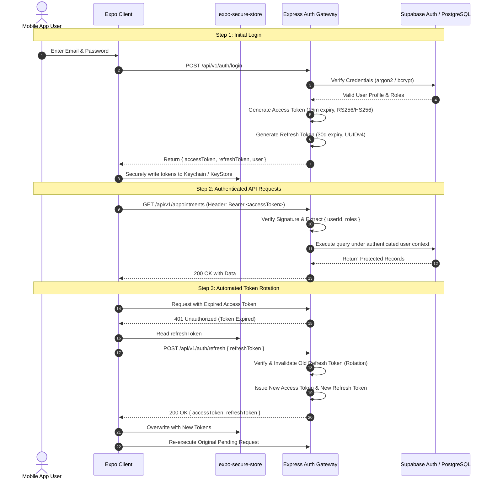

# Authentication & Security Architecture — Vetopia Mobile MVP

This document specifies the end-to-end authentication lifecycle, cryptographic token design, secure mobile client storage, and attack prevention strategies for **Vetopia Mobile**.

---

## 1. Authentication Lifecycle Diagram



---

## 2. Cryptographic Token Design

### 2.1 Access Token (JWT)
* **Format:** Signed JSON Web Token (`HMAC-SHA256` or `RS256`).
* **Lifetime:** 15 minutes.
* **Payload Claims:**
  ```json
  {
    "sub": "b2c954e1-2a6d-472e-8591-9e79b940026a",
    "email": "sarah.jenkins@example.com",
    "roles": ["pet_parent"],
    "aud": "vetopia-mobile-app",
    "iss": "https://api.vetopia.com",
    "iat": 1758547200,
    "exp": 1758548100
  }
  ```

### 2.2 Refresh Token
* **Format:** Cryptographically secure 256-bit random string (UUID v4 or opaque token).
* **Lifetime:** 30 days rolling.
* **Rotation Policy:** Single-use token rotation. When a refresh token is exchanged, it is immediately invalidated in the database, and a new refresh token is issued.
* **Replay Attack Detection:** If a previously used refresh token is submitted, the system flags a breach and immediately revokes all active refresh tokens for that user account.

---

## 3. Secure Storage on React Native

* **Implementation:** `expo-secure-store`
* **iOS Backend:** Apple Keychain Services (Encrypted with hardware AES-256 keys tied to device passcode).
* **Android Backend:** Android KeyStore Provider with Keyguard / Biometric authorization.
* **Storage Invariant:** Tokens must **never** be written to `AsyncStorage`, Redux state persisted to disk, or plaintext files.

---

## 4. Threat Modeling & Mitigation

| Threat Vector | Severity | Mitigation Strategy |
| :--- | :---: | :--- |
| **Credential Stuffing** | High | IP-based rate limiting (5 attempts per 15 min via Redis); Zod schema sanitization. |
| **Token Theft / Man-in-the-Middle** | Critical | Enforce TLS 1.3 HTTPS; native SSL certificate pinning; short 15-minute access token lifespan. |
| **Device Compromise / Jailbreak** | High | Biometric re-authentication prompt on sensitive flows (e.g. initiating payment or editing medical records). |
| **Cross-Tenant Data Exposure** | Critical | Dual-layer protection: Express RBAC middleware checks + Supabase Row Level Security (RLS) on PostgreSQL. |
| **Unauthorized Telemedicine Entry**| Critical | WebRTC signaling channels require appointment participant validation (`is_appointment_participant`). |
