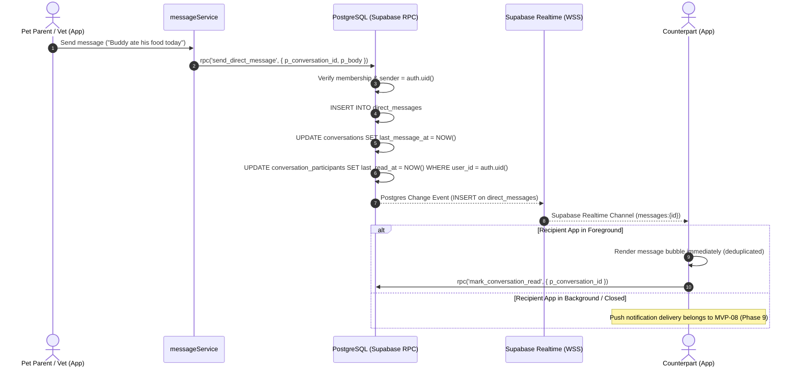

# 1-to-1 Clinical Messaging Architecture — Vetopia Mobile MVP

This document specifies the real-time asynchronous messaging architecture for **Vetopia Mobile**. Messaging is strictly scoped to **1-to-1 communication between a Pet Parent and their Consulting Veterinarian**.

---

## 1. Separation of Messaging from WebRTC

```
               ┌────────────────────────────────────────────────────────┐
               │             VETOPIA MOBILE REAL-TIME DOMAINS          │
               └───────────────────┬────────────────┬───────────────────┘
                                   │                │
            ┌──────────────────────▼──────┐  ┌──────▼─────────────────────┐
            │   CLINICAL MESSAGING        │  │   TELEMEDICINE CONSULTATION │
            │   (Asynchronous Text Inbox) │  │   (LiveKit Cloud Managed SFU) │
            ├─────────────────────────────┤  ├─────────────────────────────┤
            │ • 1-to-1 Parent <-> Doctor  │  │ • P2P / SFU Video & Audio   │
            │ • conversations table       │  │ • LiveKit JWT Room Token    │
            │ • direct_messages table     │  │ • Ephemeral consult room    │
            │ • Persistent post-consult   │  │ • Terminates when call ends │
            └─────────────────────────────┘  └─────────────────────────────┘
```

**Technical Invariant:** Telemedicine video/audio and asynchronous clinical messaging are distinct subsystems. Video/audio flows exclusively through encrypted LiveKit SFU channels and is never stored in PostgreSQL. Clinical messaging threads persist after consultation conclusion for longitudinal clinical follow-up.

---

## 2. Conversation Data Model `[IMPLEMENTED MVP-07]`

* **`conversations`:** Channel anchor table representing a clinical dialogue.
  * `id`: UUID (Primary Key)
  * `appointment_id`: UUID (FK `public.appointments.id`, nullable for unlinked threads; unique index `idx_conversations_appointment` prevents duplicates per appointment)
  * `kind`: `'general'` or `'marketplace'` (MVP restricts usage to clinical consultation context)
  * `subject`: Description or appointment summary (e.g., "Consultation: Dr. Mitchell & Buddy")
  * `created_by`: UUID (Parent or Doctor user ID, nullable)
  * `last_message_at`: TIMESTAMPTZ (Updated on every new message via RPC or trigger)
  * `created_at`: TIMESTAMPTZ
* **`conversation_participants`:** Membership mapping (exactly 2 participants in MVP).
  * `conversation_id`: UUID (FK `conversations.id`)
  * `user_id`: UUID (FK `auth.users.id`)
  * `side`: `'member'` | `'vet'`
  * `last_read_at`: TIMESTAMPTZ (Tracks read/unread message boundaries)
  * `created_at`: TIMESTAMPTZ
  * Primary Key: `(conversation_id, user_id)`
* **`direct_messages`:** Immutable text messages.
  * `id`: UUID (Primary Key)
  * `conversation_id`: UUID (FK `conversations.id`)
  * `sender_id`: UUID (FK `auth.users.id`)
  * `body`: TEXT (Length 1–4,000 characters)
  * `created_at`: TIMESTAMPTZ

---

## 3. Real-Time Delivery Pipeline



---

## 4. Unread State Calculation & Sync

* An unread message is defined as any message where:
  `direct_messages.sender_id != auth.uid() AND direct_messages.created_at > conversation_participants.last_read_at`
* When a user opens `MessageThreadScreen`, the client dispatches:
  `messageService.markConversationRead(conversationId)`
  which invokes `rpc('mark_conversation_read', { p_conversation_id })` to update `last_read_at = NOW()`.
* The inbox unread counter badge across the bottom tab bar (`SCR-TAB-004`) queries `rpc('get_unread_message_count')` and refreshes on new message events.

---

## 5. Offline Queuing & Optimistic UI Mechanism

1. While a message mutation is inflight, the composer displays sending state and prevents duplicate submissions.
2. The client optimistically places the message in the conversation thread.
3. If an error occurs (network failure or database rejection), the sending state is released and a clear error notification is rendered.
4. On realtime channel reconnect or pull-to-refresh, messages are merged and sorted chronologically without duplicates.

