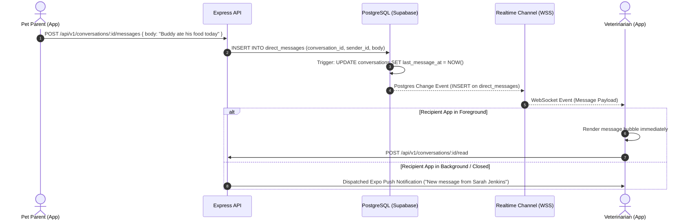

# 1-to-1 Clinical Messaging Architecture — Vetopia Mobile MVP

This document specifies the real-time asynchronous messaging architecture for **Vetopia Mobile**. Messaging is strictly scoped to **1-to-1 communication between a Pet Parent and their Consulting Veterinarian**.

---

## 1. Separation of Messaging from WebRTC

```
               ┌────────────────────────────────────────────────────────┐
               │             VETOPIA MOBILE REAL-TIME DOMAINS          │
               └───────────────────┬────────────────┬───────────────────┘
                                   │                │
            ┌──────────────────────▼──────┐  ┌──────▼─────────────────────┐
            │   CLINICAL MESSAGING        │  │   TELEMEDICINE CONSULTATION │
            │   (Asynchronous Text Inbox) │  │   (Live WebRTC Video/Audio) │
            ├─────────────────────────────┤  ├─────────────────────────────┤
            │ • 1-to-1 Parent <-> Doctor  │  │ • P2P Real-Time Video/Audio │
            │ • conversations table       │  │ • call_signals table        │
            │ • direct_messages table     │  │ • Ephemeral session         │
            │ • Persistent post-consult   │  │ • Terminates when call ends │
            └─────────────────────────────┘  └─────────────────────────────┘
```

**Technical Invariant:** Live WebRTC calling and asynchronous clinical messaging are distinct subsystems. Video/audio never flows through messaging channels, and messaging threads persist after consultation conclusion for clinical follow-up.

---

## 2. Conversation Data Model

* **`conversations`:** Channel anchor table representing a clinical dialogue.
  * `id`: UUID (Primary Key)
  * `kind`: `'general'` or `'marketplace'` (MVP restricts usage to clinical consultation context)
  * `subject`: Description or appointment summary (e.g., "Consultation: Dr. Mitchell & Buddy")
  * `created_by`: UUID (Parent or Doctor user ID)
  * `last_message_at`: TIMESTAMPTZ (Updated on every new message via database trigger)
* **`conversation_participants`:** Membership mapping (exactly 2 participants in MVP).
  * `conversation_id`: UUID (FK `conversations.id`)
  * `user_id`: UUID (FK `auth.users.id`)
  * `side`: `'member'` | `'vet'`
  * `last_read_at`: TIMESTAMPTZ (Tracks read/unread message boundaries)
* **`direct_messages`:** Immutable text messages.
  * `id`: UUID (Primary Key)
  * `conversation_id`: UUID (FK `conversations.id`)
  * `sender_id`: UUID (FK `auth.users.id`)
  * `body`: TEXT (Length 1–4000 characters)
  * `created_at`: TIMESTAMPTZ

---

## 3. Real-Time Delivery Pipeline



---

## 4. Unread State Calculation & Sync

* An unread message is defined as any message where:
  `direct_messages.sender_id != auth.uid() AND direct_messages.created_at > conversation_participants.last_read_at`
* When a user opens `MessageThreadScreen`, the client dispatches:
  `POST /api/v1/conversations/:id/read`
  which updates `conversation_participants.last_read_at = NOW()`.
* The inbox unread counter badge across the bottom tab bar updates in real-time.

---

## 5. Offline Queuing & Retry Mechanism

1. If a message is sent while the mobile device is offline, the client generates a temporary local message record with `status: 'sending'`.
2. The message is queued in an in-memory queue backed by `MMKV`.
3. Upon network reconnection (`NetInfo` event `isConnected == true`), the client flushes queued messages in chronological order.
4. If a message fails after 3 retries (e.g., server rejection), status updates to `'failed'` with a tap-to-retry prompt.
