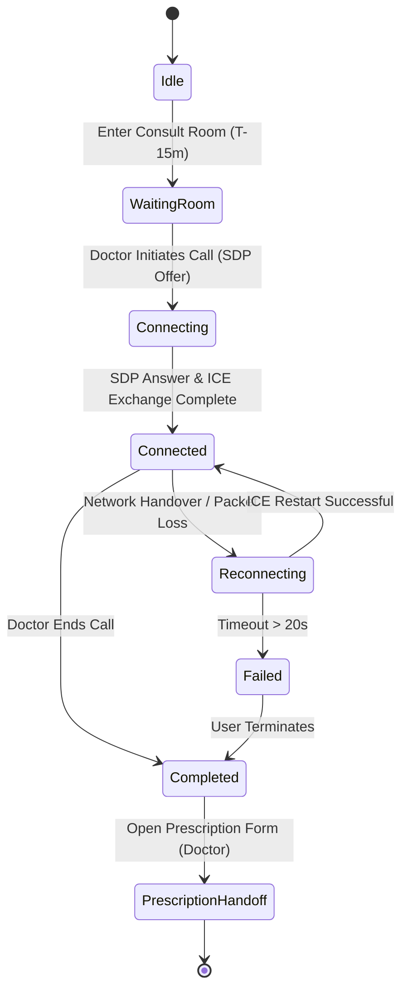

# Telemedicine & WebRTC Architecture — Vetopia Mobile MVP

This document specifies the end-to-end telemedicine architecture for **Vetopia Mobile**, covering peer-to-peer WebRTC video/audio streaming, Supabase Realtime signaling, waiting room lifecycle, network reconnection, and consultation completion handoffs.

---

## 1. Architectural Invariant & Infrastructure Decision

> [!IMPORTANT]
> **Zero Media Routing on Application Servers:** Live audio and video streams **never** route through the Express API server or the Supabase database. Media streams flow directly peer-to-peer (P2P) between the consulting veterinarian and the pet parent via encrypted SRTP/UDP.

### `[APPROVED ARCHITECTURE]` Managed RTC Provider: LiveKit Cloud SFU
**Decision Status:** `RESOLVED & APPROVED`

The project has approved **Option B: Managed Video Infrastructure (LiveKit Cloud / LiveKit SFU)** for the Mobile MVP:

* **Client SDK:** `@livekit/react-native` with `@livekit/react-native-webrtc` under the hood.
* **Token Issuance:** Node.js backend uses `livekit-server-sdk` to generate short-lived, cryptographically signed room access tokens via `POST /api/v1/telemedicine/token`.
* **Room Security:** Tokens strictly enforce room identity (`appointment_<id>`), participant identity (`user_<id>`), and permissions (doctor: publish/subscribe; parent: publish/subscribe).
* **Key Advantages for Mobile MVP:**
  1. **Cellular/Wi-Fi Handover:** Native ICE restart and multi-network migration ensures calls do not drop when users switch between Wi-Fi and 5G.
  2. **Adaptive Bitrate & Simulcast:** Automatically downgrades video quality in low-bandwidth scenarios, preventing call freezes and device overheating.
  3. **Zero TURN Server Maintenance:** Eliminates the operational overhead and failure risks of managing self-hosted Coturn clusters on AWS.
  4. **Strict Isolation:** Zero video/audio media routes through the Express API server or Supabase PostgreSQL database. LiveKit SFU handles all encrypted media relay.


---

## 2. WebRTC Call State Machine



---

## 3. End-to-End Signaling Sequence

```mermaid
sequenceDiagram
    autonumber
    actor Parent as Pet Parent (App)
    participant Channel as Supabase Realtime (call_signals)
    actor Vet as Veterinarian (App)
    participant STUN as STUN / TURN Server

    Note over Parent, Vet: Step 1: Waiting Room & Pre-Call Setup
    Parent->>Channel: Subscribe to appointment_id channel
    Vet->>Channel: Subscribe to appointment_id channel
    Vet->>Vet: Initialize local Camera & Mic (react-native-webrtc)
    Vet->>STUN: Query NAT Candidates

    Note over Parent, Vet: Step 2: SDP Offer & Answer Exchange
    Vet->>Vet: Create WebRTC SDP Offer
    Vet->>Channel: INSERT call_signals { kind: 'offer', payload: { sdp } }
    Channel-->>Parent: Broadcast 'offer' signal
    Parent->>Parent: Initialize local Camera & Mic
    Parent->>Parent: Set Remote Description (Doctor SDP Offer)
    Parent->>Parent: Create WebRTC SDP Answer
    Parent->>Channel: INSERT call_signals { kind: 'answer', payload: { sdp } }
    Channel-->>Vet: Broadcast 'answer' signal
    Vet->>Vet: Set Remote Description (Parent SDP Answer)

    Note over Parent, Vet: Step 3: Trickle ICE Candidates
    Vet->>Channel: INSERT call_signals { kind: 'ice', payload: { candidate } }
    Parent->>Channel: INSERT call_signals { kind: 'ice', payload: { candidate } }
    Channel-->>Parent: Forward Doctor ICE candidate
    Channel-->>Vet: Forward Parent ICE candidate
    
    Note over Parent, Vet: Step 4: P2P Media Connection Established
    Parent<->Vet: Direct SRTP Encrypted Video & Audio Streaming

    Note over Parent, Vet: Step 5: Termination & Handoff
    Vet->>Channel: INSERT call_signals { kind: 'hangup' }
    Parent->>Parent: Stop all media tracks & close PeerConnection
    Vet->>Vet: Stop all media tracks & close PeerConnection
    Vet->>Vet: Navigate to Create Prescription Screen
```

---

## 4. Hardware Controls & Mobile Ergonomics

* **Microphone Mute:** Disables audio track on local `MediaStream` (`audioTrack.enabled = false`) without renegotiating SDP.
* **Camera Privacy Toggle:** Disables video track (`videoTrack.enabled = false`) while maintaining continuous audio connection.
* **Camera Flip:** Switches between front-facing camera (pet parent consultation view) and rear-facing camera (zooming in on pet skin lesion or wound).
* **Audio Route Selection:** Integrates `react-native-incall-manager` to toggle between Speakerphone, Earpiece, and Bluetooth Headset.
* **Picture-in-Picture (PiP):** Allows user to minimize active video stream to inspect the pet's health passport or chat records without dropping the audio call.

---

## 5. Network Failure & Reconnection Protocol

1. When `RTCPeerConnection.connectionState` enters `'disconnected'` or `'failed'`:
   * The app freezes the last received video frame and displays a non-blocking toast: *"Connection unstable. Reconnecting..."*.
2. The client initiates an **ICE Restart**:
   * Creates a new SDP offer with `iceRestart: true`.
   * Dispatches the restart offer via `call_signals`.
3. If connection is not restored within **20 seconds**, the call gracefully drops and prompts the user:
   * *"The video connection was interrupted. Would you like to reconnect or switch to chat?"*.
