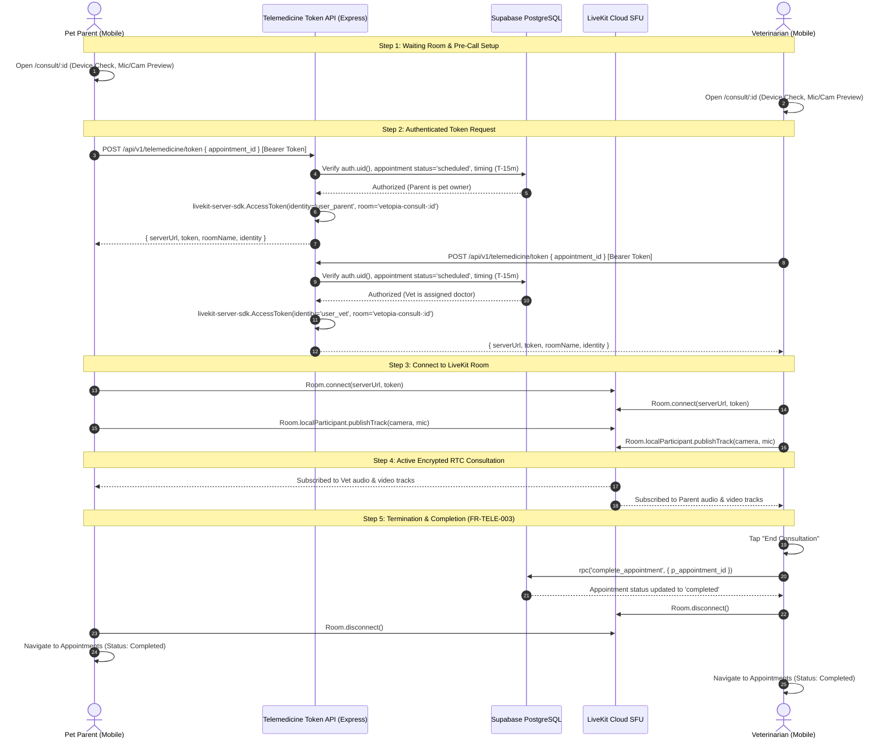

# Telemedicine RTC Architecture — Vetopia Mobile MVP (Phase 6)

This document specifies the authoritative, end-to-end telemedicine architecture for **Vetopia Mobile** (MVP-05), covering LiveKit Cloud Managed RTC SFU integration, authenticated token issuance, waiting room lifecycle, hardware controls, network recovery, and secure consultation completion.

> [!IMPORTANT]
> **SUPERSEDED ARCHITECTURE NOTICE:**
> The legacy peer-to-peer (P2P) WebRTC design utilizing custom SDP/ICE signaling, Coturn, and Supabase `call_signals` table is **permanently superseded**. No `call_signals` table, custom SDP exchange, or P2P signaling exists in this application.

---

## 1. Architectural Topology & Media Isolation

```
                    Vetopia Mobile Client
                             |
                             | Authenticated Request (Bearer Session JWT)
                             v
                  Telemedicine Token API
               (POST /api/v1/telemedicine/token)
                             |
                             | Validates Supabase auth.uid()
                             | Validates appointment exists & status is 'scheduled'
                             | Validates participant (pet parent or assigned vet)
                             | Validates consultation timing (T-15m to ends_at + 30m)
                             v
                   LiveKit Server SDK
               (Signs Short-Lived Room JWT)
                             |
                             v
                 LiveKit Cloud Managed SFU
                   (RTC Media Gateway)
                     /               \
                    /                 \
       Encrypted SRTP                 Encrypted SRTP
                 /                     \
                v                       v
      Pet Parent Client            Veterinarian Client
      (LiveKit Mobile)             (LiveKit Mobile)
```

### Architectural Invariants:
1. **Zero Media Routing on Application Servers:** Live audio and video streams **never** route through the Express API server or the Supabase PostgreSQL database. All media is handled by the LiveKit Cloud SFU over encrypted SRTP/UDP.
2. **Server-Side Authorization & Token Issuance:** The mobile client cannot generate its own LiveKit tokens or choose arbitrary rooms. Tokens are issued exclusively by the backend using `livekit-server-sdk` with minimum required grants (`roomJoin: true`, `room: vetopia-consult-<appointmentId>`).
3. **Secret Isolation:** `LIVEKIT_API_KEY` and `LIVEKIT_API_SECRET` are strictly server-side environment variables. They are never exposed to Expo public configs, mobile bundles, or client-side storage.

---

## 2. LiveKit Cloud Managed SFU Architecture

* **Client SDK:** `@livekit/react-native` and `livekit-client` with native WebRTC capabilities.
* **Token Issuance:** Node.js/Express backend (`/api/v1/telemedicine/token`) verifies appointment authorization and issues a short-lived signed JWT.
* **Deterministic Room Naming:** `vetopia-consult-{appointmentId}`.
* **Deterministic Participant Identity:** `user_{supabaseUserId}`.
* **Participant Metadata:** Minimal non-clinical metadata (`name`, `role`).
* **Key Platform Capabilities:**
  1. **Cellular/Wi-Fi Handover:** Native LiveKit ICE restart and multi-network migration ensures calls do not drop when switching between Wi-Fi and 5G.
  2. **Adaptive Bitrate & Simulcast:** Automatically downgrades video quality in low-bandwidth scenarios, preventing call freezes and device overheating.
  3. **No Infrastructure Maintenance:** Managed SFU eliminates the operational risk and cost of self-hosted Coturn/media servers.

---

## 3. End-to-End Consultation Sequence



---

## 4. Consultation Timing & Eligibility Invariants

A user can enter the consultation room when:
* `appointment.status == 'scheduled'`
* Current time is within **15 minutes prior to `starts_at`** (T-15m) or up to **30 minutes after `ends_at`** (elapsed window).
* Cancelled (`status == 'cancelled'`) or completed (`status == 'completed'`) appointments are strictly rejected with HTTP 409 Conflict.
* Client-side assumptions are never trusted; timing is evaluated server-side against ISO-8601 UTC timestamps stored in Supabase.

---

## 5. Hardware Controls & Device Checks

* **Microphone Mute:** Toggles microphone audio stream on/off.
* **Camera Privacy Toggle:** Toggles camera video stream on/off while maintaining continuous audio. In audio-only mode (`mode == 'audio'`), camera is disabled by default.
* **Camera Flip:** Switches between front-facing camera (consultation) and rear-facing camera (pet physical examination).
* **Speakerphone / Earpiece:** Toggles audio output route.
* **Permissions Management:** Graceful handling of camera and microphone permissions with informative warning states and retry options.

---

## 6. Network Resilience & Reconnection Protocol

* When network disruption or packet loss occurs, LiveKit triggers internal connection recovery.
* The UI displays a non-blocking reconnection indicator with a live countdown: `Connection unstable. Reconnecting... ({seconds}s)`.
* In accordance with SRS requirements, the system attempts recovery for **20 seconds**.
* If automatic recovery does not succeed within 20 seconds, a manual "Connection lost. Tap to reconnect now." CTA is provided to re-establish the connection.

---

## 7. Consultation Completion & Security Definer RPC

* **Authoritative Actor:** Only the consulting veterinarian can mark a consultation appointment as completed.
* **PostgreSQL RPC:** `complete_appointment(p_appointment_id uuid)`.
* **Security Model:** Defined with `SECURITY DEFINER` and `SET search_path = public`.
* **Enforcement:**
  - Validates `auth.uid() IS NOT NULL` (PostgreSQL error 28000).
  - Validates `appointment` exists (PostgreSQL error P0002).
  - Validates `appointment.status == 'scheduled'` (PostgreSQL error P0001).
  - Validates `vet_profiles.user_id == auth.uid()` for the assigned vet (PostgreSQL error 42501).
* **Teardown:** Disconnects LiveKit room, stops local media tracks, invalidates React Query cache, and routes to appointments screen.
