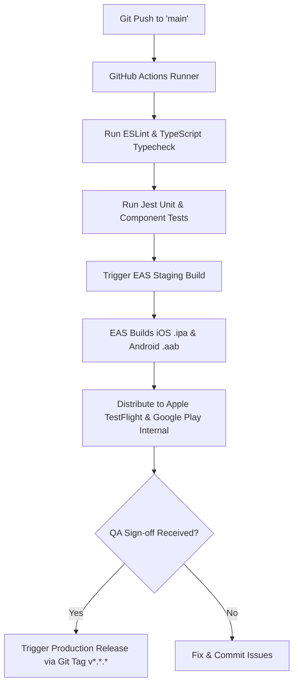

# Deployment & CI/CD Architecture — Vetopia Mobile MVP

This document specifies the deployment pipeline, build configuration, environment management, and release strategies for **Vetopia Mobile**.

---

## 1. Environment Configurations

Vetopia Mobile operates across three isolated environments:

| Configuration Variable | Development (`dev`) | Staging (`staging`) | Production (`prod`) |
| :--- | :--- | :--- | :--- |
| **API Base URL** | `http://10.0.2.2:3000/api/v1` | `https://staging-api.vetopia.com/api/v1` | `https://api.vetopia.com/api/v1` |
| **Supabase URL** | `https://dev-proj.supabase.co` | `https://staging-proj.supabase.co` | `https://prod-proj.supabase.co` |
| **Bundle Identifier (iOS)** | `com.vetopia.app.dev` | `com.vetopia.app.staging` | `com.vetopia.app` |
| **Package Name (Android)** | `com.vetopia.app.dev` | `com.vetopia.app.staging` | `com.vetopia.app` |
| **Sentry Environment** | `development` | `staging` | `production` |

---

## 2. EAS Build Configuration (`eas.json`)

```json
{
  "cli": { "version": ">= 12.0.0" },
  "build": {
    "development": {
      "developmentClient": true,
      "distribution": "internal",
      "ios": { "simulator": true }
    },
    "staging": {
      "distribution": "internal",
      "channel": "staging",
      "env": { "APP_ENV": "staging" }
    },
    "production": {
      "distribution": "store",
      "channel": "production",
      "autoIncrement": true,
      "env": { "APP_ENV": "production" }
    }
  },
  "submit": {
    "production": {
      "ios": { "appleId": "dev@vetopia.com", "ascAppId": "6470000000" },
      "android": { "serviceAccountKeyPath": "./google-service-account.json" }
    }
  }
}
```

---

## 3. GitHub Actions CI/CD Pipeline



---

## 4. Crash Reporting & Observability (Sentry)

* Integrated via `@sentry/react-native`.
* Automatically captures unhandled exceptions, native crashes, and rejected promises.
* Tracks WebRTC connection metrics (time to ICE connection, dropped call rates).
* Source maps are uploaded automatically during EAS Build runs to ensure de-minified stack traces in production error dashboards.
